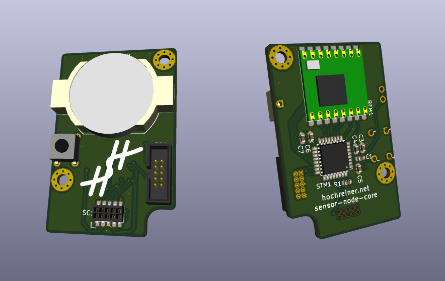
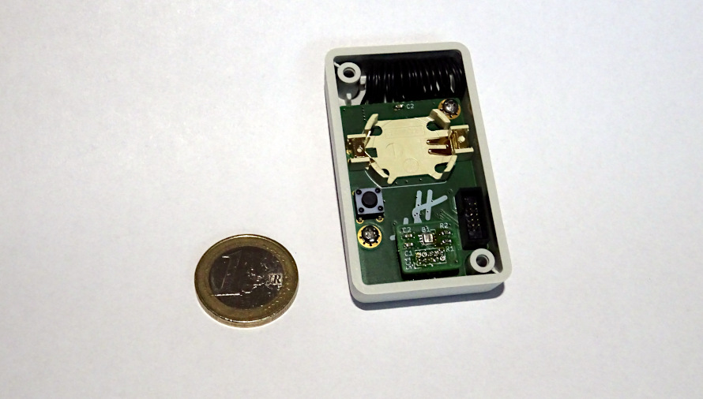

# Sensor Node Core

This is another take on the sensor node theme.
I am planning on separating the core form the actual sensor.
The core will contain the micro-controller (incl. debug connector and reset button), radio (incl. antenna), and battery, as well as a connector providing power, SPI, I2C, and GPIOs.

## Main parts

### STM32
  * STMicroelectronics: STM32L021K4T6
  * Digi-Key: [497-17903-ND](https://www.digikey.de/product-detail/de/stmicroelectronics/STM32L021K4T6/497-17903-ND)
  * [datasheet](http://www.st.com/content/ccc/resource/technical/document/datasheet/86/a6/5f/95/33/50/4e/d6/DM00206858.pdf/files/DM00206858.pdf/jcr:content/translations/en.DM00206858.pdf)
  * Sleep Current: 0.54 µA
  * Price: 1.87

### RFM98
  * Seeed Technology Co., Ltd: 109990165
  * Digi-Key: [1597-1491-ND](https://www.digikey.de/product-detail/de/seeed-technology-co-ltd/109990165/1597-1491-ND)
  * [datasheet](https://github.com/SeeedDocument/RFM95-98_LoRa_Module/blob/master/RFM95_96_97_98_DataSheet.pdf)
  * Sleep Current: 0.2 µA
  * Price: 6.05

### Box
  * Hammond Manufacturing: 1551JGY
  * Digi-Key: [HM1133-ND](https://www.digikey.de/product-detail/de/hammond-manufacturing/1551JGY/HM1133-ND/2094871)
  * [Datasheet](http://www.hammondmfg.com/pdf/1551J.pdf)
  * Price: 2.09

### SWD Connector
  * CNC Tech: 3220-10-0100-00
  * Digi-Key: [1175-1627-ND](https://www.digikey.de/product-detail/en/cnc-tech/3220-10-0100-00/1175-1627-ND/3883661)
  * Price: 0.51

### 10-pin Sensor Connector
  * Harwin Inc.: M50-3150542R
  * Digi-Key: [952-3493-1-ND](https://www.digikey.de/product-detail/en/harwin-inc/M50-3150542R/952-3493-1-ND/6797677)
  * [Datasheet](https://cdn.harwin.com/pdfs/M50-315R.pdf)
  * Price: 2.27

### Coin Cell Holder
  * MPD (Memory Protection Devices): BU2032-1-G
  * Digi-Key: [BU2032-1-G-ND](https://www.digikey.de/product-detail/en/mpd-memory-protection-devices/BU2032-1-G/BU2032-1-G-ND/2439519)
  * [Datasheet](http://www.memoryprotectiondevices.com/datasheets/BU2032-1-G-datasheet.pdf)
  * Price: 0.89

### Button
  * TE Connectivity ALCOSWITCH Switches: 1825910-6
  * Digi-Key: [450-1650-ND](https://www.digikey.de/product-detail/en/te-connectivity-alcoswitch-switches/1825910-6/450-1650-ND/1632536)
  * [Datasheet](https://www.te.com/commerce/DocumentDelivery/DDEController?Action=srchrtrv&DocNm=1825910&DocType=Customer+Drawing&DocLang=English)
  * Price: 0.09

## Price

Estimate: about 20 EUR
